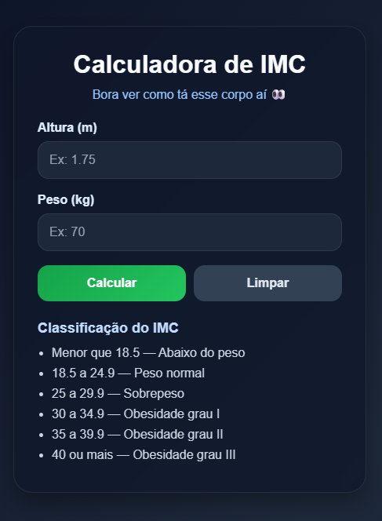

# Calculadora de IMC

Esse projeto eu fiz baseado em um trabalho que tive quando estava cursando ADS, só que dessa vez resolvi refazer do zero pra ver se eu realmente tinha aprendido alguma coisa.

Spoiler: apanhei bastante no começo 👍

## 🌐 Acesse o projeto

(https://juskcibem.github.io/calculadora-imc/)
---

## 💀 O que rolou

No início achei que ia ser simples… "ah é só um cálculo né"

- esqueci de ligar o JS no HTML (fiquei um tempão tentando entender pq nada funcionava)
- errei id no `getElementById` e quebrou tudo
- o layout ficou HORRÍVEL nas primeiras tentativas
- mexi em CSS sem saber direito oq tava fazendo (muito tutorial envolvido aqui)
- tive que refazer várias vezes até parar de ficar estranho

---

## 🎓 Um pouco da minha trajetória

Eu comecei fazendo ADS, mas acabei trancando quando estava indo pro terceiro semestre.

Tirei um tempo pra pensar (um "ano sabático") e nesse período percebi que eu queria entender mais a fundo as coisas, não só usar ou montar sistemas.

Quando voltei, decidi mudar pra Engenharia da Computação justamente por isso, pra ir além e entender melhor como tudo funciona por trás.

(sim, faltavam 3 semestres… mas às vezes a gente precisa dar uns passos pra trás pra seguir o caminho certo 😅)

---

## 🎥 O que me salvou

Teve muito tutorial envolvido (sem vergonha nenhuma de falar kkk)

Principalmente do Gustavo Guanabara (Curso em Vídeo), que ajudou bastante a entender melhor a base e não sair fazendo tudo no chute.

---

## 😅 O resultado

Não tá perfeito, mas tá funcionando e visualmente ficou aceitável (o que pra mim já é vitória)

A calculadora:
- calcula o IMC
- mostra a classificação
- tem validação básica
- tem botão de limpar
- funciona no celular (depois de apanhar um pouco)

---

## 🤡 Momento de crise existencial

Testando com meus próprios dados:

- antes de casar: 69kg  
- depois: 95kg  
- altura: 1.77  

Resultado... melhor nem comentar 💀

Essa calculadora virou mais um tapa na cara do que qualquer outra coisa

---

## 🛠 Tecnologias usadas

- HTML (tranquilo)
- CSS (aqui eu sofri)
- JavaScript (até que foi de boa)

---

## 🚀 Próximas ideias (talvez eu faça)

- melhorar mais o visual
- adicionar animação
- mudar cor dependendo do IMC
- talvez salvar histórico

---

## 👨‍💻 Autor

Hugo

(feito na base do ódio, tentativa e erro e uns vídeos no YouTube)
